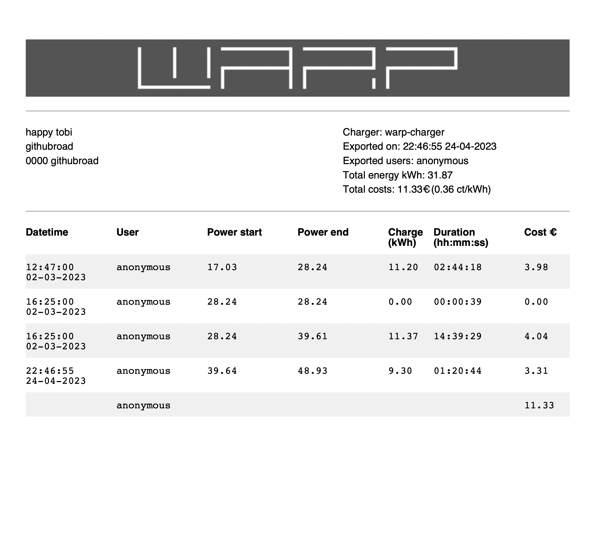

# Warp cli

`warp` is a cli tool for the [Warp-charger](https://www.warp-charger.com).
The cli tool brings the http api to the terminal.


## Command overview
| Command | Description |
| --- | --- |
| `warp info` | Get information about the warp charger |
| `warp info version warp` | Get the version of the warp charger |
| `warp info version update` | Check if an warp charger update is available |
| `warp info name` | Get the name of the warp charger |
| `warp infor display-name` | Get the display name of the warp charger |
| `warp info modules` | Get the modules of the warp charger |
| `warp info features` | Get the features of the warp charger |
| `warp meter values` | Get the meter values of the warp charger |
| `warp users list` | Get the users of the warp charger |
| `warp charge-tracker` | Get information about the charge tracker |
| `warp charge-tracker log` | Get the charge tracker log (csv or pdf) |
| `warp version` | Get the version of the warp cli |
| `warp charge start` | Start charging for a user with or without a specific power |
| `warp charge stop` | Stops the current charging |
| `warp configuration` | Create a warp cli configuration file (default at ~/.config/warp/warp.yaml) |

Each command has a help page, which can be accessed with the `-h` or `--help` flag.
The help page prints the usage of the command and the available flags.

## Configuration
The configuration file is located at `~/.config/warp/warp.yaml`.

#### Default configuration
```yaml
charger:
    address: "http://my-ip" # optional same as -c
    user: "foo" # optional same as -u
    password: "bar" # optional  same as -p
csv:
    comma: ; # separator for csv
    header: true # add header to csv
pdf:
    image_path: /root/.config/warp/logo.png # path to the logo image for the pdf
    print_header: false # print header in pdf
settings:
    date_time:
        time_format: 15:04:05 02-01-2006 #date time format
        time_zone: Europe/Berlin # time zone to print the date time
    power:
        price: "35.55" # price per kWh
    user: # user information that will be added to the pdf if print_header is true
        city: internet
        firstname: happy
        lastname: tobi
        postcode: "0000"
        street: githubroad
```

#### Build warp cli

To build a executable for your system, your have to do the following steps:
- Install go 1.19 or higher
- Download the source from github https://github.com/HappyTobi/warp/archive/refs/heads/main.zip,
and extract it.

Run the following commands in the extracted folder:
```bash
make release
cd build/
```

## Example usage

### Start charging
```console
$ warp charge start -c "http://mywarp.ip -u "username" -p "password" -r "warp-user" -a 6000

"Charging started for user warp-user with 6000 ampere"
```

### Info version
```console
$ warp info name -c "http://mywarp.ip -u "username" -p "password"

{
 "display_type": "WARP Charger Pro 22kW +NFC",
 "name": "warp-UTD",
 "type": "warp",
 "uid": "UTD"
}
```

### Charge tracker
```console
$ warp charge-tracker log -c "http://mywarp.ip -u "username" -p "password"

[
 {
  "Time": "2023-03-06T18:14:00Z",
  "User": "happyTobi",
  "PowerMeterStart": 111.929,
  "PowerMeterEnd": 139.224,
  "Duration": "13:06:58"
 }
]
```

### Charge tracker csv export
```console
$ warp charge-tracker log -c "http://mywarp.ip -u "username" -p "password" -o csv -f ~/Desktop/my-charge-document.csv
```

### Charge tracker pdf export
```console
$ warp charge-tracker log -c "http://mywarp.ip -u "username" -p "password" -o pdf -f ~/Desktop/my-charge-document.pdf
```

Example pdf document:


### Evcc integration
The warp cli evcc integration can be used to interact with a warp charger that has user management enabled.

An example configuration of evcc an the warp cli looks like:

```yaml
# Charger
chargers:
  - name: evcc_warp_charger
    type: custom
    status:
      source: script
      cmd: /path/to/warp evcc status --config ~/.config/warp/warp.yaml
      timeout: 5s
    enabled:
      source: script
      cmd: /path/to/warp evcc enabled -u myuser -p mypass -c http://mycharger
      timeout: 5s
    enable:
      source: script
      cmd: /path/to/warp evcc enable --enable ${enable} --config ~/.config/warp/warp.yaml
      timeout: 5s
    maxcurrent:
      source: script
      cmd: /path/to/warp evcc maxcurrent --current ${maxcurrent} --config ~/.config/warp/warp.yaml
      timeout: 5s
```

## Warp Charger information

[Product Page](https://www.warp-charger.com)

[API Documentation](https://www.warp-charger.com/api.html)